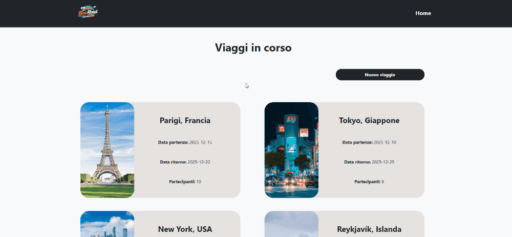

# BoolRoad

Un software progettato per un'agenzia di viaggi, finalizzato all'organizzazione e alla visualizzazione strutturata dei viaggiatori.

Il progetto si concentra sulla manipolazione di un database simulato tramite lo stato di **React**, permettendo una navigazione fluida tra la panoramica generale e i dettagli specifici di ogni itinerario.

### Demo

### Tecnologie utilizzate

* **React**
* **React Router Dom**
* **JavaScript**